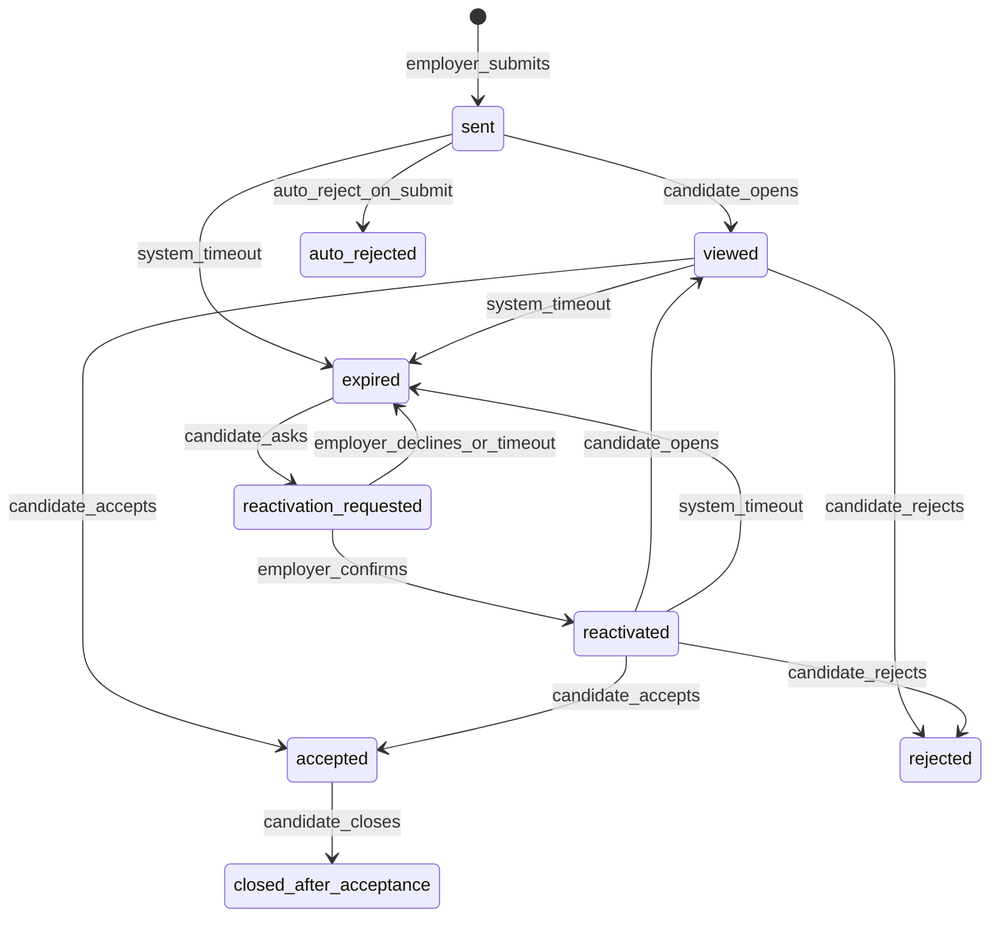

# Application State Machine

Formal specification for **Application** (employer response to resume). See [ADR-0003](../adr/0003-application-state-machine.md).

## Diagram

## Statuses

| Status | Terminal | Chat | Description |
|--------|----------|------|-------------|
| `sent` | no | no | Delivered to candidate inbox |
| `viewed` | no | no | Candidate opened details |
| `accepted` | no | **open** | Candidate agreed; chat active |
| `rejected` | **yes** | no | Candidate declined |
| `auto_rejected` | **yes** | no | Auto-reject rules fired on submit |
| `expired` | no* | no | System deadline passed |
| `reactivation_requested` | no | no | Candidate asked if still valid |
| `reactivated` | no | no | Employer confirmed; awaiting decision |
| `closed_after_acceptance` | **yes** | read-only | Candidate ended cooperation |

\* `expired` can move to `reactivation_requested`.

## Transitions

| From | To | Actor | Trigger | Side effects |
|------|-----|-------|---------|--------------|
| — | `sent` | employer | Submit application | Debit limit; save snapshots; set expires_at; notify candidate; audit |
| — | `auto_rejected` | system | Submit with auto-reject confirmed | Debit limit; save snapshots; notify employer (rejected); audit |
| `sent` | `viewed` | candidate | Open application card | Set viewed_at; notify employer; audit |
| `sent` | `expired` | system | Cron: now > expires_at | Notify both parties; audit |
| `viewed` | `accepted` | candidate | Confirm accept dialog | Create chat; notify employer; audit |
| `viewed` | `rejected` | candidate | Confirm reject dialog | Optional shared reasons; notify employer; audit |
| `viewed` | `expired` | system | Cron | Same as sent→expired |
| `accepted` | `closed_after_acceptance` | candidate | Close cooperation | Chat read-only; audit |
| `expired` | `reactivation_requested` | candidate | "Still interested?" button | Notify employer; audit |
| `reactivation_requested` | `reactivated` | employer | Confirm still valid | Reset expires_at; notify candidate; audit |
| `reactivation_requested` | `expired` | employer/system | Decline or timeout | audit |
| `reactivated` | `viewed` | candidate | Open card | Same as sent→viewed |
| `reactivated` | `accepted` | candidate | Accept | Same as viewed→accepted |
| `reactivated` | `rejected` | candidate | Reject | Same as viewed→rejected |
| `reactivated` | `expired` | system | Cron | audit |

## Forbidden actions

| Status | Employer cannot | Candidate cannot |
|--------|-----------------|------------------|
| `sent` | withdraw, edit application | accept without viewing (optional: allow direct accept) |
| `viewed` | withdraw | un-reject |
| `accepted` | — | un-accept (only close → read-only) |
| `rejected` | resubmit same vacancy | reopen |
| `auto_rejected` | resubmit same vacancy | accept |
| `expired` | — | accept without reactivation flow |
| `closed_after_acceptance` | send messages | send messages |

**Note:** Employer can never resubmit same `(resume_id, vacancy_id)` regardless of status (DB unique constraint).

## Expiration rules

- Default `expires_at` = created_at + **14 days**
- Employer may set `employer_deadline` ≤ expires_at (display only hint to candidate)
- Employer may **extend once** before expiry: +14 days, set `extended_once = true`
- Background job runs periodically to transition `sent`/`viewed`/`reactivated` → `expired`

## Auto-reject flow

On submit, domain checks resume `auto_reject_settings`:

1. If mismatch (salary / work_format / location): show warning to employer (UI)
2. If mode = `mark_only`: create `sent` with flag `mismatch=true` on application
3. If mode = `auto_reject`: employer must confirm; then create `auto_rejected`, debit limit

## Chat coupling

| Event | Chat state |
|-------|------------|
| `viewed` → `accepted` | Create chat, `is_read_only=false` |
| `accepted` → `closed_after_acceptance` | `is_read_only=true` |
| Company blocked by candidate | All company chats `is_read_only=true` |
| Company blocked by admin | Same |

## Notifications per transition

| Transition | Candidate | Employer |
|------------|-------------|----------|
| → `sent` | new application | — |
| → `viewed` | — | application viewed |
| → `accepted` | — | accepted |
| → `rejected` | — | rejected (reasons if shared) |
| → `expired` | expiring soon (before) | — |
| → `reactivation_requested` | — | reactivation request |
| → `reactivated` | reactivated | — |

## Test implementation checklist

- [ ] Invalid transition raises `InvalidTransitionError`
- [ ] Limit debited exactly once on `sent` or `auto_rejected`
- [ ] Snapshots immutable after create
- [ ] UNIQUE violation on duplicate submit
- [ ] Chat created only on accept
- [ ] Block company sets chats read-only
- [ ] Extension only once
- [ ] Cron expires applications
